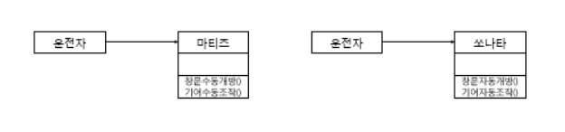
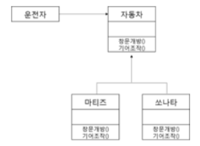
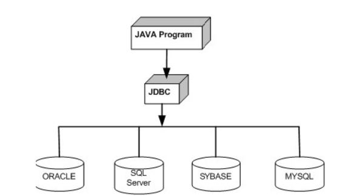
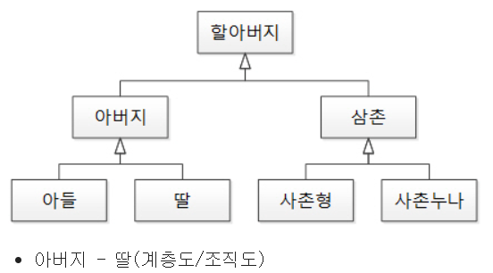
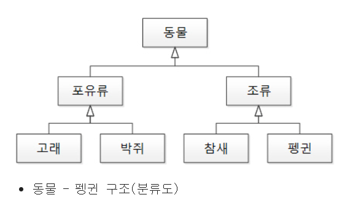
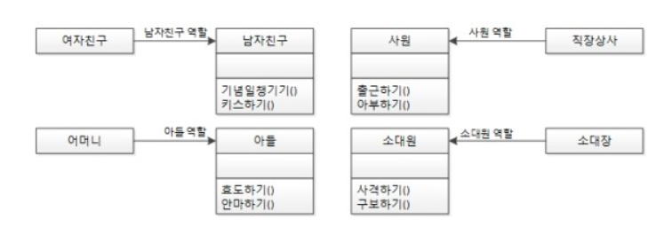
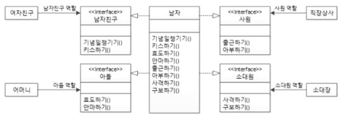
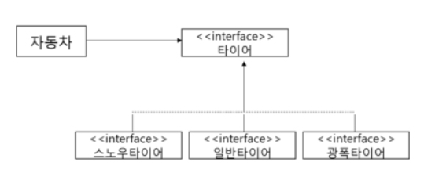

# OOP 프로그램의 설계 원칙 (SOLID)

## SOLID (객체지향설계)
- S(SRP) 단일 책임의 원칙 : 작성된 클래스는 하나의 기능만 가지며, 클래스가 제공하는 모든 서비스는 그 하나의 책임을 수행하는 데 집중 되어 있어야 한다.
- O(OCP) 개방폐쇄의 원칙 : 소프트웨어의 구성요소(컴포넌트,클래스,모듈,함수)는 확장에는 열려있고, 변경에는 닫혀있어야 한다.기존 구성요소는 수정이 일어나지 말아야 하며, 쉽게 확장 해 재사용 할 수 있어야 한다.
- L(LSP) 리스코브 치환의 법칙 : 서브타입은 언제든 기반 타입으로 교체할 수 있어야 한다. 하위 타입 객체는 상위 타입 객체에서 가능한 행위를 수행할 수 있어야 함(올바른 상속관계의 특징 정의, 쉽게 말해서 자식 클래스가 부모 클래스 대신 사용될 수 있어야 한다는 말!)
- I(ISP) 인터페이스 분리의 법칙 : 사용하지 않는 인터페이스는 구현하지 말아야 한다. 즉 클라이언트의 목적과 용도에 적합한 인터페이스 만을 제공해야 한다.  인터페이스의 분리/단일책임
- D(DIP) 의존성역전의 원칙 :  의존 관계를 맺을 때, 변하기 쉬운 것 (구체적인 것) 보다는 변하기 어려운 것 (추상적인 것)에 의존해야 함


## SRP(Single Responsibility Principle): 단일 책임의 원칙
 클래스는 하나의 기능만 가지고, 클래스가 제공하는 모든 서비스는 그 하나의 책임을 수행해야 한다는 원칙.   

메소드가 SRP를 지키지 못 한 경우
``` 
    class girthdayGender{
        final static Boolean 남자 = true;
        final static Boolean 여자 = false;
        Boolean 성별 ;

        void genderGubon(){
            if (this.성별 == 남자){
                // 앞자리 1
            }else{
                // 앞자리 2
            }
        }
    }
```
클래스 코드를 보면 gnederGubon() 메소드에서 남자,여자를 모두 구현하려고 해서 단일책임의 원칙을 위반하고 있음


```
    abstract class BirthdayGender {
        abstract void genderGubon ();
    }

    class 남자성별 extends BirthdayGendr {
        void genderGubon(){
            // 앞자리 1
        }
    }

    class 여자상별 extends BirthdayGendr {
        void genderGubon(){
            // 앞자리 2
        }    
    }

```
위와 같이 BirthdayGender 라는 추상 클래스를 두고 남자성별, 여자성별 클래스가 각자 자신의 특징에 맞게 genderGubon90() 메소드를 구현하여 사용하는 것을 리팩터링이라고 함. 이렇게 객체 지향 특성과 가장 관계가 깊은 것이 바로 추상화이다. 

## OCP(Open Closed Priciple): 개방 폐쇄 원칙

확장에 대해서는 열려있어야 하고, 변경에 있어서는 닫혀 있어야 한다.
    
EX.

위 그림처럼 운전자가 기어가 수동이냐 자동이냐에 따라 행동이 달라질 수 있다. 이렇게 변화가 있을 때 운전자에게 바로 영향이 오기 때문에 개방 폐쇄 원칙에 위배 됨


  
이렇게 상위 클래스 또는 인터페이스를 중간에 둠으로써 다양한 자동차가 생겨도 객체지향 세계의 운전자는 기어나 운전 습관에 영향을 받지 않게 된다. 다양한 자동차가 생기는 것은 자동차의 입장에서 확장되는 개념으로 확장에는 개방되어 있고, 운전자 입장에서 주변 변화에는 닫혀있는 것이다.

데이터베이스의 개방 폐쇄 원칙의 좋은 예(JDBC가 개방 폐쇄 원칙의 가장 좋은 예시 임 )



## LSP(Listov Substitution Priciple): 리스코프 치환 원칙
부모 타입과 자식타입간의 상호 호환이 가능해야 한다
다만, 자식 타입은 부모 타입의 한 종류임으로 함부로 객체를 만들어 내변 안된다. 

리스코프 치환 원칙 위배


리스코프 치환 원칙 잘 지킨 예


즉, 자식 클래스의 인스턴스는 부모 객체 참조 변수에 대입 해 상위 클래스의 인스턴스 역할을 하는데 문제가 없어야 한다.

## ISP(Interface Segregation Principle): 인터페이스 분리 원칙
자신이 사용하지 않는 메소드에 의존 관계를 맺으면 안된다. 즉, 각 역할에 맞게 인터페이스로 분리하는 것. 단일 책임 원칙과 관련된 법칙

단일 책임 원칙  
  
인터페이스 분리 법칙


- 상위 클래스는 풍성 할 수록 좋다. 
- 풍성 할 수록 하위 클래스에게 많은 기능을 확장시켜주고, 형변환, 코드중복을 줄여준다.
- 인터페이스는 하위 클래스에게 구현을 강제하도록 하는 역할. 즉 최소한의 기능만 제공하면서 하나의 역할에 집중하라는 뜻

## DIP(Dependency Inversion Principle): 의존 역전 원칙
 고차원 모듈은 저차원 모듈에 의존하면 안 된다. 이 두 모듈은 다른 추상화된 것에 의존해야 한다. 추상화된 것은 구체적인 것에 의존하면 안된다. 

자동차의 예를 들어보면
자동차가 특정 타이어에 의존을 하게 된다면 타이어가 바뀔 때 마다 자동차는 영향을 받을 수 있게 된다.   

이렇게 구체적인 특정 타이어가 아닌 추상화된 타이어 인터페이스에만 의존하게 함으로써 타이어가 변경되어도 자동차는 영향을 받지 않게 된다.
