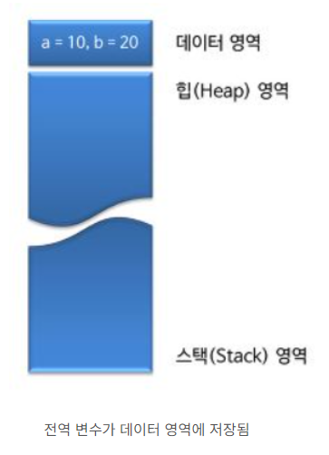

# object 객체
 
## 기본형 타입(primitive type) 과 참조형 타입(Reference type)

### primitive(기본 자료형) 의 특징
- 총 8가지의 기본형 타입을 미리 정의하여 제공
- 기본값이 있기 때문에 null이 존재하지 않음.(기본형 타입에 null 을 넣으려면 래퍼 클래스 이용)
- 실제 값을 저장하는 공간으로 스텍(stack) 메모리에 저장된다.
- 컴파일 시점에 담을 수 있는 크기를 벗어나면 컴파일 에러 발생, 주로 문법상의 에러가 많음


Primitive Type(8가지) 
```
   수치형 
    -- 정수형
        byte:1byte(-2^7 ~ 2^7-1 :-128 ~ 127)
        short:2byte(-2^15~2^15-1 : -32768~32767)
        int:4byte(-2^31 ~ 2^31-1 : -2147483648 ~ 2147483647)
        long:8byte(-2^63 ~ 2^63-1) 
    -- 실수형
        float:4byte
        double:8byte
   문자형  
        char : '가' 'A' '\u0000' 2byte(0~2^16-1:0~ 65535)
   논리형 
        boolean : true, false(1bit)
```  

### Reference type(참조형 타입)의 특징
- 기본형 타입을 제외한 타입드이 모두 참조형 타입.
- 빈 객체를 의미하는 null이 존재함.
- 값이 저장되어있는 곳의 주소값을 저장하는 공간으로 힙(Heap) 메모리에 저장된다.
- 문법상으로는 에러가 없으나, 실행시켰을 때 에러나는 런타임 에러가 발생.

Reference type
```
    배열(Array)
    열거(Enumeration)
    클래스(Class)
    인터페이스 (Interface)
```

::: tip Wrapper 
--------------------------------------------------------  
    기본자료형(Primitive Type)	|  참조형(Reference Type)  
    --------------------------------------------------------  
	byte			            |   Byte
	short			            |   Short
	int			                |   Integer
	long			            |   Long
	float			            |   Float
	double			            |   Double
	char			            |   Character
	boolean			            |   Boolean
--------------------------------------------------------  
:::

  

::: tip   stack영역 과 heap영역   
프로그램을 실행시키면 운영체제는, 실행한 프로그램을 위해서 메모리 공간을 할당해 주게 되는데, 이 때 할당되는 메모리의 공간이 크게 스택, 힙, 데이터 영역으로 나누어지게 된다. 할당되는 장소는 메인 메모리(RAM)에 할당되며, 할당되는 용도는 프로그램 실행 시 필요한 메모리 공간을 지정하기 위해서 할당된다.



스택 영역(자동 메모리)  
    - 함수 호출시에 생성, 함수 호출이 완료되면 사라짐.
    - 잠깐 사용하고 삭제하는 데이터 저장(지역변수, 매개변수)   
    - 해당 객체가 정의된 블록(스코프)을 벗어날 때 소멸  
    - 함수의 호출하는 위치도 저장.  
    - 힙보다 빠름(런 타임에 크기가 결정)  
    - 후입선출의 방식으로 가장 나중에 들어온 데이터가 가장 먼저 인출된다.  

힙 영역(자유 저장소)  
    - 가비지 컬렉터가 없으면 프로그래머가 직접 관리(할당/해제)해줘야 함.  
    - 스택보다 큰 메모리를 할당받기 위해 사용  
    - 동적 메모리 할당 ( new 연산자 / 포인터 )  
    - delete연산자를 사용하여 해당 객체 메모리 해제
    - 스택보다 느림(컴파일 타임에 크기가 결정)
    - 선입선출(FIFO)의 방식으로 가장 먼저 들어온 데이터가 먼저 인출된다.
:::

## object의 주요 메소드
1. equals  : 두 개의 객체가 같은지 비교하여 같으면 TRUE , 다르면 FALSE 반환
2. hashcode : 객체의 해쉬코드값을 반환 
3. toString  : 현재 객체의 문자열을 반환
4. clone : shallow/deep  : 복사

### equals() 메소드

``` java
public boolean equals(object obj){
    return (this == obj);
}
```
Object 클래스의 equals()메소드는 위와같이 구성 되어 있음. 참조값(객체의 주소값)이 같은지, 동일한 객체인지를 확인하는 역할.
하위 클래스에서 재정의(오버라이딩)해서 사용할 수 있습니다. 대표적인 클래스로 String 클래스가 있음. String 클래스는 Object의 equas()메소드를 재정의하여 객체의 주소값이 아닌 문자열 비교를 하도록 작성되어있음.

``` java
public boolean equals(Object anObject) {
    if (this == anObject) {
        return true;
    }
    if (anObject instanceof String) {
        String aString = (String)anObject;
        if (coder() == aString.coder()) {
            return isLatin1() ? StringLatin1.equals(value, aString.value)
                              : StringUTF16.equals(value, aString.value);
        }
    }
    return false;
}
```
재정의된 equals() 메소드를 살펴보면 먼저, 같은 String 타입인지 확인 후, 값을 비교하는 형태임. 만약 어느 하나라도 맞지 않는다면 false가 반환되는 것.

``` java
public static void main(String[] args) {
    String str1 = "Hello";
    String str2 = "Hello";

    System.out.println(str1.equals(str2)); // true 반환
}
```

 - 동일성 vs 동등성
동일성 비교 : "==" 비교를 의미. 객체 인스턴스의 주소값을 비교하는 것.
동등성 비교 : 객체 내부의 값을 비교 


### hashcode() 메소드
해시코드란, 객체를 식별할 수 있는 하나의 정수 값을 의미한다. 객체의 메모리 주소값을 이용하여 리턴하기 때문에 객체마다 상이한 값을 가지고 있다. 
``` java
    String str1 = "Hello";
    String str2 = "Hello";
    Car car1 = new Car();
    Car car2 = new Car();

    System.out.println(str1.hashCode());
    System.out.println(str2.hashCode()); 
    // 동일한 값

    System.out.println(car1.hashCode());
    System.out.println(car2.hashCode());
    // 다른 값
```
따라서 동등 비교를 할 때 사용하고, hashCode()메소드에 대한 오버라이딩이 필요하다.

hash란 ?


### toString() 메소드 
``` java
public String toString(){
    return getClass().getName()+"@"+Integer.toHexString(hashCohe());
}
```
Object 클래스의 toString()메소드는 위와같이 구성 되어 있다. 해시코드를 반환 하지만, 사실상 객체의 특징,특성과 관련된 내용을 반환하는 것이 더 의미있으므로 주로 toString()메소드를 재정의 하여 사용한다.
``` java
    @Override
    public String toString(){
        return "this is"+ 필드명;
    }
```
이처럼 toString() 메소드를 이용해서 객체가 가진 정보를 반환할 형식과 내용을 지정할 수 있다.


### clone() 메소드 
clone()메소드는 해당 인스턴스를 복제하여, 새로운 인스턴스를 생성해 반환한다.
하지만 Object 클래스의 clone() 메소드는 단지 필드의 값만을 복사하므로, 필드의 값이 배열이나 인스턴스면 제대로 복제할 수 없다.  
따라서 이러한 경우에는 해당 클래스에서 clone() 메소드를 오버라이딩하여, 복제가 제대로 이루어지도록 재정의해야 한다.

 #### Shallow Clone vs Deep Clone 
1-1. Shallow Clone   
    - 객체를 복사할 때, 해당 객체만 복사하여 새 객체를 생성  
    - 복사된 객체의 인스턴스 변수는 원복 객체의 인스턴스 변수와 같은 메모리 주소를 참조
    - 해당 메모리 주소의 값이 변경되면 원복 객체 및 복사 객체의 인스턴스 변수 값은 같이 변경
    
    public class Test{
        public static void main(String[] args) throw CloneNotSupportedException{
            Parent paren = new Parent();

            Parent.setName("부모값");
            Parent child = Parent;  // shallow clone

            System.out.println("부모 결과 : " + parent.getName());  // 부모 결과 : 부모값
            System.out.println("자식 결과 : " + child.getName());   // 자식 결과 : 부모값

            Parent.setName("새 부모값");

            System.out.println("부모 결과 : " + parent.getName());   //부모 결과 : 새 부모값
            System.out.println("자식 결과 : " + child.getName());    //자식 결과 : 새 부모값
        }        
    }

1-2. Deep Clone  
    - 객체를 복사할 때 해당 객체와 인스턴스 변수까지 복사하는 방식
    - 전부를 복사하여 새 주소에 담기 때문에 참조를 공유하지 않음.

     public class Test{
        public static void main(String[] args) throw CloneNotSupportedException{
            Parent paren = new Parent();

            Parent.setName("부모값");
            Parent child = (Parent) parent.clone;  // Deep clone

            System.out.println("부모 결과 : " + parent.getName());  // 부모 결과 : 부모값
            System.out.println("자식 결과 : " + child.getName());   // 자식 결과 : 부모값

            Parent.setName("새 부모값");

            System.out.println("부모 결과 : " + parent.getName());   //부모 결과 : 새 부모값
            System.out.println("자식 결과 : " + child.getName());    //자식 결과 : 부모값
        }        
    }


